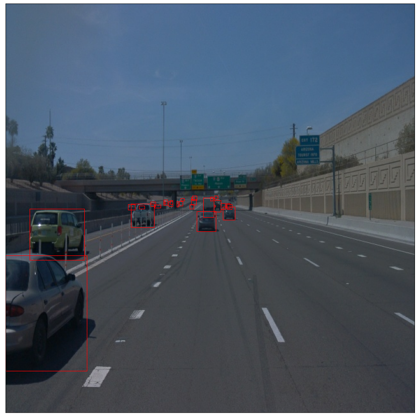

# Object Detection in the Urban Environment Project
This repository contains my project submission to the Object Detection in the Urban Environment project of the Udacity Data Scientist course.

## Project Summary

This project explores detecting objects in an urban environment annotating cyclists, pedestrians and vehicles, based on the Waymo dataset and the TensorFlow Object Detection API.

Detecting such objects accurately and without error is a crucial task in self-driving car scenarios, since seeing and placing them correctly is the basis for taking correct controlling decisions, with potentially catastrophic consequences in case of errors. 

The code is basically structured into the following parts:

1. An exploratory data analysis has been done using the notebook `Exploratory Data Analysis.ipynb`. See [discussion below](#dataset-analysis) for the results.

1. Models have been trained using a set of config files, and bash and python scripts. 

1. An exploratory augmentation notebook visualizes the configured augmentations.

1. TODO animation

This repository has both the necessary code to reproduce these steps in the Udacity classroom workspace, as well as [a detailed discussion of their previous execution at the end of this file](#dataset).

## Repository Structure
The repository is structured as follows:

```bash
ds-object-detection-urban-environment
├── experiments
│   ├── exporter_main_v2.py           # Script to create an inference model.
│   ├── label_map.pbtxt
│   ├── model_main_tf2.py             # Script to to launch training.
│   ├── experiment-1
│   │   ├── .gitignore                # Local gitignore file.
│   │   └── pipeline_new.config       # Experiment configuration.
│   ├── experiment-2
│   │   ├── .gitignore                # Local gitignore file.
│   │   └── pipeline_new.config       # Experiment configuration.
│   ├── pretrained_model              
│   │   └── .gitignore                # Local gitignore file.
│   └── reference                     # Target directory for trained reference model.
│       ├── .gitignore                # Local gitignore file.
│       └── pipeline_new.config       # Experiment configuration.
├── visualizations
│   └── ...                           # Charts, images, etc. 
├── .gitignore                        # Gitignore file. 
├── download_pretrained_model.sh      # Bash script to dowload and unpack pre-trained model.
├── edit_config.py                    # Script to update experiment config.
├── Exploratory Data Analysis.ipynb   # Notebook with exporatory data analysis.
├── Explore augmentations.ipynb       # Notebook with augmentations exploration.
├── requirements.txt                  # List of imported Python packages.
├── train_reference_model.sh          # Bash script to train reference model.
├── update_udacity_workspace.sh       # Bash script to update Udacity workspace.
├── utils.py                          # Helper functions.
└── README.md                         # This file.
```

The contents of this repository have been partially built on the template files in the [Udacity Computer Vision Starter GitHub repository](https://github.com/udacity/nd013-c1-vision-starter).

## Usage

### Prerequisites
This project is ready to be executed in the Udacity classroom workspace environment, which has the readily split Waymo data already downloaded and stored in subfolders under `/home/workspace/data`. To download and split the data yourself, please refer to the according steps in the [Computer Vision Starter github project](https://github.com/udacity/nd013-c1-vision-starter).

The Udacity classroom workspace uses Python 3.6.3 and uses the following packages:

TODO


The following command will install these packages according to the configuration file `requirements.txt`. The file was generated using `pip3 freeze`.

```
$ pip install -r requirements.txt
```

In the classroom workspace, every library and package should already be installed in your environment, so installing the requirements should not be necessary.

### Installation

1. Checkout this repository. 

    ```
    $ git clone https://github.com/budde/ds-object-detection-urban-environment.git
    ```

1. Copy its contents into the folder `/home/workspace` in the Udacity classroom environment, overwriting existing files and folders by the same name.

    ```
    $ /bin/cp -rf ds-object-detection-urban-environment/* /home/workspace/
    ```
    
    :warning: The above command will overwrite any existing file or folder by the same name **without prompting for confirmation**, so make sure that is what you want and/or backup the folder first.


1. To remedy potential stability issues when running the Jupyter notebooks in firefox, this repository includes a bash script that will update the installed firefox. 

    ```
    $ ./update_udacity_workspace.sh
    ```

    :warning: This will only work in a GPU enabled workspace, as running the desktop is not possible otherwise at all. 

    This step is not needed when running this project locally outside of the Udacity classroom workspace.

In case this project should be run locally instead of in the Udacity classroom workspace, the steps are very similar: Make sure to also clone this repository into a folder `/home/workspace`, then additionally download, transform and split the Waymo data according to the steps described in the [Computer Vision Starter github project](https://github.com/udacity/nd013-c1-vision-starter).

### Execution

After copying the files from this repository into the Udacity classroom workspace, the three parts of the script can be executed as follows:

#### Running the Exploratory Data Analysis notebook

When all the prerequisites are met, the Jupyter notebook can simply be started as usual:

```
$ jupyter notebook
```

However, since in the Udacity classroom desktop workspace this will result in an error, instead run 

```
$ ./launch_jupyter.sh
```

This should launch a browser containing your notebooks. If the browser doesn't launch on its own, just open a browser window and open up the URL shown in the output of the respective command above.

#### Training and evaluating models

1. Creating and running the reference model

    First, the pre-trained SSD Resnet 50 640x640 model needs to be downloaded and the configuration edited. To facilitate this for the reference model, the according steps have been grouped into a bash script:

    ```
    $ ./download_pretrained_model.sh
    ```

    Subsequently, the training can be started:

    ```
    $ ./train_reference_model.sh
    ```
    This will write the output of the script to `train_reference_model.log`. To monitor the training and/or evaluation of the reference model graphically, a tensorboard instance can be launched:

    ```
    python -m tensorboard.main --logdir experiments/reference/
    ```

    The findings of the monitoring of the reference model training can be found [in the discussion below](#reference-experiment).

1. Training other models

    Generally, to start the training for any of the experiments, execute

    ```
    python experiments/model_main_tf2.py --model_dir=experiments/<experiment-folder>/ --pipeline_config_path=experiments/<experiment-folder>/pipeline_new.config
    ```
     substituting `<experiment-folder>` with the appropriate paths.

1. Model evaluation

    Once the training is finished, launch the evaluation process:
    ```
    python experiments/model_main_tf2.py --model_dir=experiments/<experiment-folder>/ --pipeline_config_path=experiments/<experiment-folder>/pipeline_new.config --checkpoint_dir=experiments/<experiment-folder>/
    ```
     again substituting `<experiment-folder>` with the appropriate paths.

    
    :warning: Both training and evaluation may display some Tensorflow warnings, which can be ignored. You may have to kill the evaluation script manually using
    <kbd>CTRL</kbd>+<kbd>C</kbd>.
    
    To monitor the training, you can launch a tensorboard instance by running `python -m tensorboard.main --logdir experiments/<experiment-folder>/`. 

#### Exporting and creating animations

1. Export the final model

    In case you have added experiments beyond the ones configured in the repository, modify the arguments of the following function to adjust it to your final model:
    
    ```
    python experiments/exporter_main_v2.py --input_type image_tensor --pipeline_config_path experiments/experiment-2/pipeline_new.config --trained_checkpoint_dir experiments/experiment-2/ --output_directory experiments/experiment-2/exported/
    ```
    This should create a new folder `experiments/experiment-2/exported/saved_model`. You can read more about the Tensorflow SavedModel format [here](https://www.tensorflow.org/guide/saved_model).
    
1. Creating an animation
    Finally, you can create a video of the final model's inferences for any tf record file. To do so, run the following command (if necessary, adjust file paths):
    ```
    python inference_video.py --labelmap_path label_map.pbtxt --model_path experiments/experiment-2/exported/saved_model --tf_record_path /data/waymo/testing/segment-12200383401366682847_2552_140_2572_140_with_camera_labels.tfrecord --config_path experiments/experiment-2/pipeline_new.config --output_path animation.gif
    ```
    The animation generated based on the final model is displayes [at the end of the discussion below](#animation-of-final-model-performance).

## Dataset
### Dataset analysis
The dataset features point-of-view images from cars. The images are accompanied by ground truth data which contains bounding boxes for three classes of objects (cars, pedestrians, and cyclists). The following example image shows a highway traffic situation. The cars are highlighted by red bounding boxes:




While the images all have the same dimensions and resolution, they are extremely heterogeneous in terms of lighting (day, night), quality (blur, lens flares, etc.), weather conditions (sunshine, rain, fog, etc.), as well as the type and number of objects visible in any given image, their density/line-of-sight (clear, partially occluded, cut off by edge of image), and size (close/large, far/small). The following image illustrates this contrast when compared to the one above, as it was taken at nighttime and features pedestrians (blue bounding boxes) in addition to (parking) cars:


In addition to these qualitative differences, the dataset is also uneven in terms of the class distribution. In a sample of 50,000 images, the vast majority either featured only cars or cars and pedestrians. The third largest class (well below 10%) had at least one object from each class. Images with only pedestrians, only cyclists or both without cars are very seldom within the dataset, and even combined lie below the number of images without any objects at all (~1%):


This is also reflected when looking at the absolute number of objects in the same sample. Over the same 50,000 images, we counted well in excess of 800,000 cars (~17 per image on average), a little more than 200,000 pedestrians (~4 per image on average) and in comparison practically no cyclists.


## Training
### Reference experiment
The reference model was trained according to the example instructions above, which initiate the model with the following parameters:

| Parameter         | Setting                                        |
|-------------------|------------------------------------------------|
| Pre-trained model | SD Resnet 50 640x640                           |
| Batch size        | 2                                              |
| Training steps    | 2,500                                          | 
| Augmentations     | Random horizontal flip <br/> Random crop image |
| Optimizer         | Momentum optimizer (value 0.9)                 |
| Learning rate     | Cosine decay (base: 0.04, warmup rate: 0.013333, warmup steps: 200) | 

  
When looking at the results of the reference experiment, it becomes clear that the algorithm's performance is very poor:


The classification loss fluctuates strongly and goes up and down. The total loss does not drop below ~20. The reference model does not seem to have converged with the number of epochs. An increase of the number of steps seems to be a first sensible direction to explore.

### Improve on the reference
This section details the different attempts made to improve the model. 

#### Experiment-1

In the first experiment, the only change to the reference model was to increase the number of training steps to 10,000, resulting in the following parameters:

| Parameter         | Setting                                        |
|-------------------|------------------------------------------------|
| Pre-trained model | SD Resnet 50 640x640                           |
| Batch size        | 2                                              |
| Training steps    | 10,000                                         | 
| Augmentations     | Random horizontal flip <br/> Random crop image |
| Optimizer         | Momentum optimizer (value 0.9)                 |
| Learning rate     | Cosine decay (base: 0.04, warmup rate: 0.013333, warmup steps: 200) | 
  
When looking at the results of this experiment, it becomes clear that the model still does not seem to have converged.


As a result, further increase of the number of epochs is warranted.


#### Experiment-2

In the second experiment, the number of epochs was further increased to 25,000. At the same time, the batch size was increased to 4, and additional augmentations were introduced according to the tests in `Explore augmentations.ipynb`. The learning rate was also adjusted to a lower setting:

| Parameter         | Setting                                        |
|-------------------|------------------------------------------------|
| Pre-trained model | SD Resnet 50 640x640                           |
| Batch size        | 4                                              |
| Training steps    | 25,000                                         | 
| Augmentations     | Random horizontal flip <br/> Random crop image <br/> [Random adjust brightness](https://www.tensorflow.org/api_docs/python/tf/image/random_brightness) <br/> [Random adjust contrast](https://www.tensorflow.org/api_docs/python/tf/image/random_contrast) <br/> [Random adjust hue](https://www.tensorflow.org/api_docs/python/tf/image/random_hue) <br/> [Random adjust saturation](https://www.tensorflow.org/api_docs/python/tf/image/random_saturation) <br/> [Random rgb to gray](https://www.tensorflow.org/api_docs/python/tf/image/rgb_to_grayscale) <br/> |
| Optimizer         | Momentum optimizer (value 0.9)                 |
| Learning rate     | Cosine decay (base: 0.01, warmup rate: 0.004, warmup steps: 200) | 
 
##### Data augmentations
Samples of the augmentations that were applied here can be seen below. In addition to the random horizontal flip and crop, random modifications of [brightness](https://www.tensorflow.org/api_docs/python/tf/image/random_brightness), [saturation](https://www.tensorflow.org/api_docs/python/tf/image/random_saturation), [hue](https://www.tensorflow.org/api_docs/python/tf/image/random_hue) and [contrast](https://www.tensorflow.org/api_docs/python/tf/image/random_contrast) were introduced and 10% of the images were randomly [converted to grayscale](https://www.tensorflow.org/api_docs/python/tf/image/rgb_to_grayscale). The following images were generated using the code in `Explore augmentations.ipynb`:


##### Final model performance

With these modifications TODO

##### Animation of final model performance
